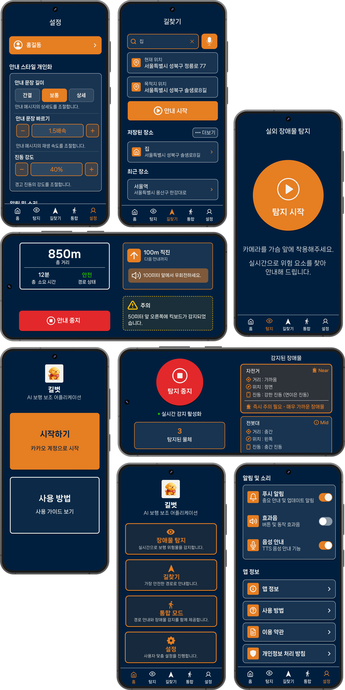
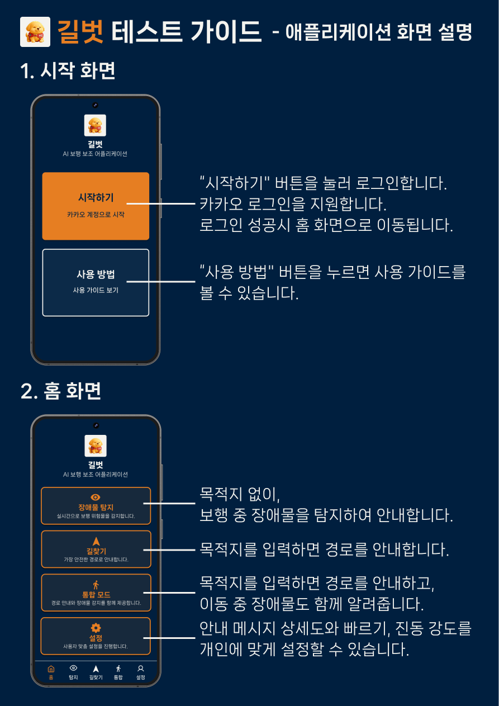
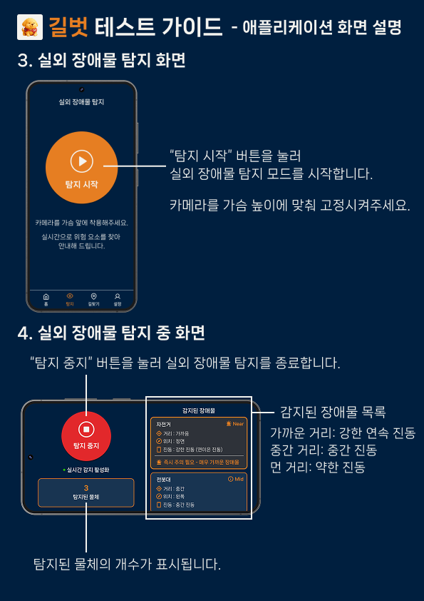
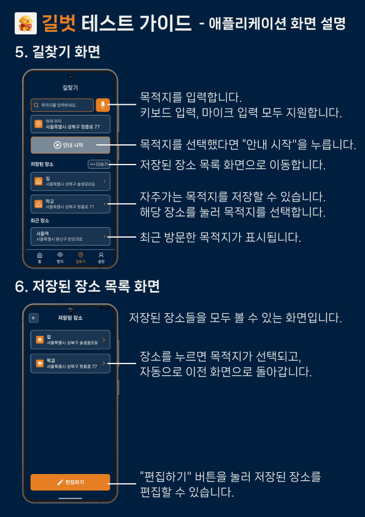
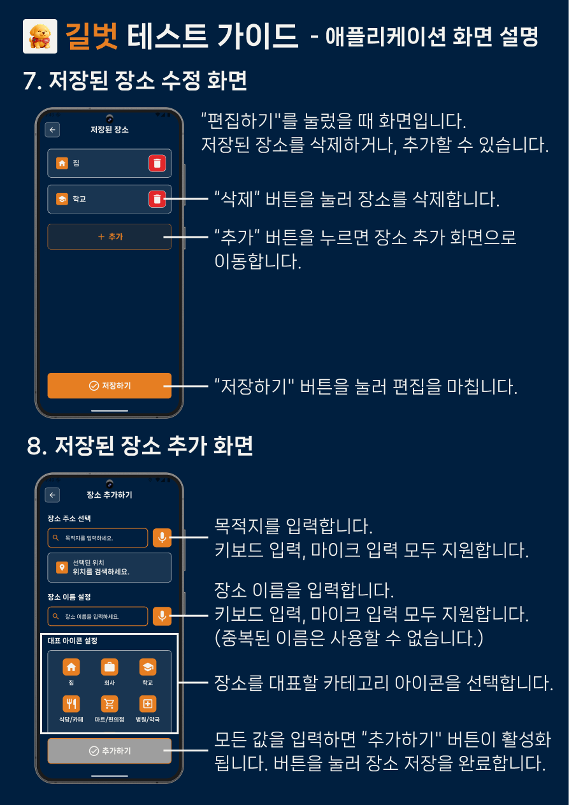
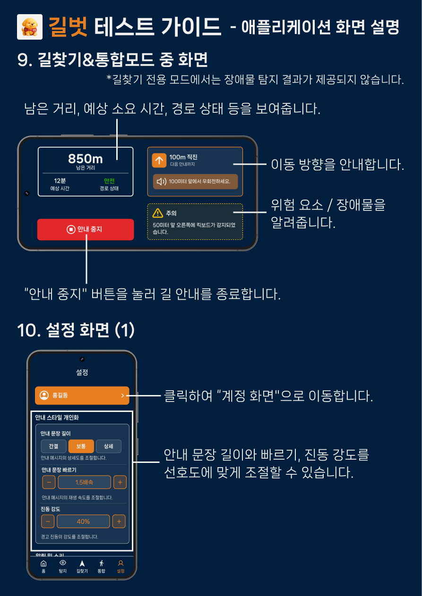
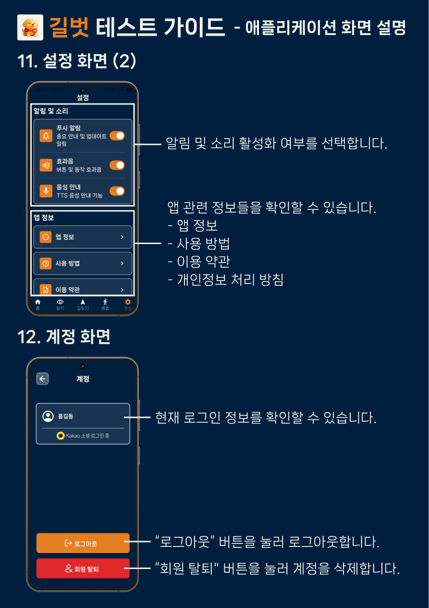

<!-- markdownlint-disable MD025 MD033 MD036 -->

# 당신의 걸음 곁에, **"길벗"**

> 시각장애인과 저시력자가 보다 안전하고 독립적으로 이동할 수 있도록 돕는  
> **AI 기반 보행 보조 서비스**

<div align="center">
  
</div>

## 🌐 프로젝트 소개 사이트

[https://kookmin-sw.github.io/2026-capstone-16/](https://kookmin-sw.github.io/2026-capstone-16/)

## 🎬프로젝트 소개 영상

추후 프로젝트 소개 영상 링크 추가 예정

## 📌 목차

- [프로젝트 소개](#-프로젝트-소개)
- [주요 기능](#-주요-기능)
- [시스템 구조도](#️-시스템-구조도)
- [기술 스택](#️-기술-스택)
- [사용법](#-사용법)
- [폴더 구조](#-폴더-구조)
- [기대 효과](#-기대-효과)
- [팀원 소개](#-팀16-리트리버-소개)
- [참고 자료](#-참고-자료)

## 🌟 프로젝트 소개

본 프로젝트 **"길벗"** 은 시각장애인 및 저시력자의 안전한 보행을 지원하기 위한 **모바일 기반 보행 보조 애플리케이션** 을 개발하는 것을 목표로 합니다.

스마트폰 카메라와 인공지능 기반 객체 인식 기술을 활용하여 사용자의 주변 환경을 **실시간으로 분석**하고, 보행 중 발생할 수 있는 장애물을 탐지합니다. 단순히 장애물을 감지하는 것에 그치지 않고, 장애물의 위치를 분석하여 사용자에게 **최적의 회피 방향**을 안내합니다. 예를 들어 장애물이 사용자의 정면에 위치한 경우 *"왼쪽으로 이동하세요."* 와 같은 음성 안내를 제공하여 사용자가 안전하게 장애물을 피할 수 있도록 지원합니다.

또한, 사용자가 목적지를 입력하면 **음성 기반 길찾기 기능**을 통해 경로를 안내하며, 시각장애인을 고려한 **접근성 중심 UI**와 **TTS(Text-to-Speech) 기반 음성 피드백** 시스템을 통해 화면을 보지 않아도 모든 정보를 전달받을 수 있도록 설계되었습니다.

## ✨ 주요 기능

### 1. 🚧 장애물 탐지 및 회피 방향 안내

- 스마트폰 카메라 영상을 기반으로 보행 중 위험한 장애물을 **실시간 탐지**
- **YOLOv11s** 모델로 사람, 차량, 자전거, 킥보드 등 객체를 인식하고, **YOLOv8-SEG**로 보행 가능 영역을 분석하여 실제 위험 여부 판단
- 탐지된 장애물의 위치·거리·위험도를 분석해 **안전한 회피 방향** 안내

### 2. 🗺️ 길찾기

- 사용자의 현재 위치와 목적지를 기반으로 **보행 경로** 안내
- **TMAP 보행자 경로 API** 활용 — 이동 거리, 소요 시간, 회전 지점 등 핵심 정보 제공
- 공공 데이터를 수집해 보행 경로 내 **횡단보도 및 음향신호기** 존재 여부 안내

### 3. 🔊 음성 및 햅틱 안내

- 화면을 보지 않아도 정보를 인지할 수 있도록 **음성(TTS)** 과 **진동(햅틱)** 으로 안내
- 위험 상황, 방향 안내, 길찾기 정보 등을 **멀티모달** 방식으로 전달
- **사용자 맞춤 설정** 지원 (음성 속도·안내 문구 길이 등 직접 조절 가능)

### 4. ♿ 접근성 중심 사용자 인터페이스

- 시각장애인의 사용성을 고려한 **간단하고 직관적인 모바일 UI**
- 큰 버튼과 최소 조작 구조를 적용해 **누구나 쉽게 사용**할 수 있도록 설계

## 🏗️ 시스템 구조도

<!-- 시스템 구조도 이미지 삽입 -->
<div align="center">
  
  <!-- 이미지 준비 후 위 경로를 실제 이미지 경로로 교체하세요 -->
</div>

## 🛠️ 기술 스택

### Frontend


### Backend


### AI / ML


### External API


### Data


### Collaboration


## 📖 사용법

<div align="center">
  <table>
    <tr>
      <td align="center" width="33%">
        
      </td>
      <td align="center" width="33%">
        
      </td>
      <td align="center" width="33%">
        
      </td>
    </tr>
    <tr>
      <td align="center" width="33%">
        
      </td>
      <td align="center" width="33%">
        
      </td>
      <td align="center" width="33%">
        
      </td>
    </tr>
  </table>
</div>

1. **시작 화면 / 홈 화면** — 카카오 로그인 후 장애물 탐지, 길찾기, 설정 기능에 접근합니다.
2. **장애물 탐지 화면** — 탐지 시작 버튼을 누르면 카메라가 실시간으로 장애물을 감지하고 진동으로 알려줍니다.
3. **길찾기 화면** — 목적지를 키보드 또는 음성으로 입력하고 안내를 시작합니다.
4. **저장된 장소 관리** — 자주 가는 장소를 저장하고, 카테고리 아이콘으로 구분하여 빠르게 선택합니다.
5. **길찾기 중 / 설정 화면** — 남은 거리·소요 시간·위험 요소를 안내하고, 안내 문구 길이와 진동 강도를 조절합니다.
6. **설정 / 계정 화면** — 알림·소리 설정, 앱 정보 확인, 로그아웃 및 회원 탈퇴를 할 수 있습니다.

## 📁 폴더 구조

```md
2026-capstone-16/
├── frontend/                
│   ├── android/
│   ├── ios/
│   ├── assets/
│   ├── lib/
│   ├── pubspec.lock
│   └── pubspec.yaml
│
├── server/                 
│   ├── src/
│   ├── gradle/
│   ├── build.gradle
│   ├── settings.gradle
│   ├── gradlew
│   ├── gradlew.bat
│   └── Dockerfile
│
├── ai/                   
│   ├── app/
│   ├── models/
│   └── requirements.txt
│
├── docs/                    
│   ├── _pages/
│   ├── _layouts/
│   ├── _includes/
│   ├── _sass/
│   ├── _data/
│   ├── assets/
│   └── index.md
│
└── README.md
```

## 💡 기대 효과

| 분야 | 기대 효과 |
| ------ | ----------- |
| 🦺 **안전성** | 실시간 장애물 탐지로 보행 중 사고 위험 감소 |
| 🚶 **독립성** | 보조인 없이 스스로 목적지까지 이동 가능 |
| ♿ **접근성** | 시각장애인 맞춤 UI/UX로 누구나 쉽게 사용 |
| 🌍 **사회적 포용** | 이동 취약계층의 사회 참여 기회 확대 |
| 📡 **확장 가능성** | 공공 인프라 데이터 연동으로 서비스 고도화 가능 |

---

## 👥 팀16-리트리버 소개

**팀 16 — 리트리버**

| 이름 | 학번 | 역할 |
| --- | --- | --- |
| 한여진 | 20233119 | Frontend |
| 황연주 | 20233123 | Frontend |
| 전예찬 | 20213078 | Backend |
| 양나래 | 20223103 | Backend |
| 이일환 | 20213048 | AI |
| 김예지 | 20223058 | AI |

---

## 📚 참고 자료

- [TMAP 보행자 API 공식 문서](https://tmapapi.tmapmobility.com/)
- [Ultralytics YOLOv11 문서](https://docs.ultralytics.com/)
- [공공데이터포털 — 음향신호기 데이터](https://www.data.go.kr/)
- 추가 참고 자료는 업데이트 예정입니다.

---

<div align="center">
© 2026 Team 리트리버 | 길벗 프로젝트

*"당신의 걸음 곁에, 길벗"*

</div>
