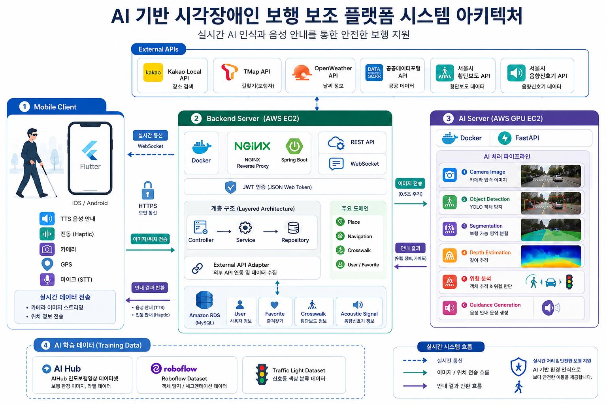

# 길벗

시각장애인 및 보행약자를 위한 AI 기반 안전 보행 보조 플랫폼

---

## 프로젝트 소개

길벗은 스마트폰 카메라와 AI 기반 객체 탐지 기술을 활용하여  
시각장애인과 보행약자가 실외 환경에서 보다 안전하게 이동할 수 있도록 지원하는 서비스이다.

카메라 영상을 실시간으로 분석하여 보행 위험 요소를 탐지하고,  
음성 및 진동 피드백을 통해 즉각적인 안내를 제공한다.

---

## 주요 기능

### 보도 장애물 탐지

- 킥보드
- 볼라드
- 공사 바리케이드
- 차량
- 자전거

등의 위험 요소를 탐지하고 회피 방향 안내 제공

---

### 횡단보도 및 신호등 인식

- 횡단보도 위치 인식
- 보행자 신호등 상태 분류
- 음향신호기 데이터 연동
- 안전한 횡단 보조

---

### 점자블록 및 보행 가능 영역 분석

- 점자블록 segmentation
- 보행 가능 영역 추출
- 경계 영역 분석
- 안전한 이동 방향 계산

---

### 음성 및 진동 안내

- TTS 기반 음성 안내
- 위험 상황 진동 피드백
- 방향 안내
- 실시간 장애물 경고

---

## 시스템 구조



---

## 기술 스택

### Frontend

- Flutter
- Dart

### Backend

- Spring Boot
- Java 21
- MySQL
- JWT
- WebSocket

### AI

- YOLO
- Segmentation
- FastAPI
- PyTorch

### Infra

- AWS EC2
- Docker
- Nginx

---

## 프로젝트 목표

- 시각장애인의 독립적인 이동 능력 향상
- 보행 중 충돌 및 낙상 사고 예방
- 별도 장비 없이 스마트폰 기반 접근성 제공
- 공공 보행 안전 데이터 확장 가능성 확보

---

## 팀 리트리버

| 이름 | 역할 |
|---|---|
| 한여진 | 프론트엔드 |
| 황연주 | 프론트엔드 |
| 양나래 | 백엔드 |
| 전예찬 | 백엔드 |
| 김예지 | 인공지능 |
| 이일환 | 인공지능 |

---

## GitHub

- Backend: `kookmin-sw/2026-capstone-16`
- GitHub Pages: `kookmin-sw.github.io/2026-capstone-16`

---

## Demo

```bash
Coming Soon
```
